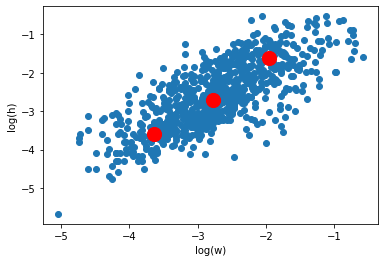

# Session 12

#### YOLO explained and image dataset annotations and bounding box calculations.

The VIA Project helps to draw bounding boxes for entities of ineterst in images and then automatically generates JSON formatted file with `centroid` x and y coordinates for bounding box, `heigh` and `width` of the bounding box with the `type` (usually a string decided upon by used).

*Example:*
> "028.jpg81008":{"filename":"028.jpg","size":81008,"regions":[{"shape_attributes":{"name":"rect","x":236,"y":213,"width":320,"height":181},"region_attributes":{"class_name":"hardhat"}},{"shape_attributes":{"name":"rect","x":314,"y":446,"width":244,"height":181},"region_attributes":{"class_name":"mask"}},{"shape_attributes":{"name":"rect","x":186,"y":645,"width":426,"height":308},"region_attributes":{"class_name":"vest"}}],"file_attributes":{}}

### *The main dictionary have filename and file size appended as the key*

### *The value is another dictionary containing essential details about the file and bounding boxes*

### *The inner dictionary contains `filename`, `size`, `regions` and `file_attributes` as keys*

### *The `regions` key has a list of dictionaries as corresponding value*

### *Each item in `regions` list represents one bounding box and it's details*

### *Each dictionary in `regions` list has `shape_attributes` as one key and the corresponding value is a dictionary with "name","x","y","width","height" details, where `x` and `y` are centroids of the bounding box and width, height it's details*

### *There is another key to each dictionary of `regions` item, `region_attributes` which holds a dictionary with the attribute id and it's value, representing the class the bounding box represent*

### *Similarly, each boudning box for an image is represented via each dictionary item in `regions` list, where each item has two keys (`shape_attributes` and `region_attributes`)

### *As per the Elbow method for finding out optimal cluster number, we can see that it turns out to be k=3 for this dataset of images*

